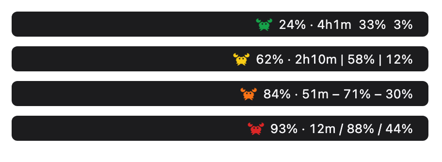
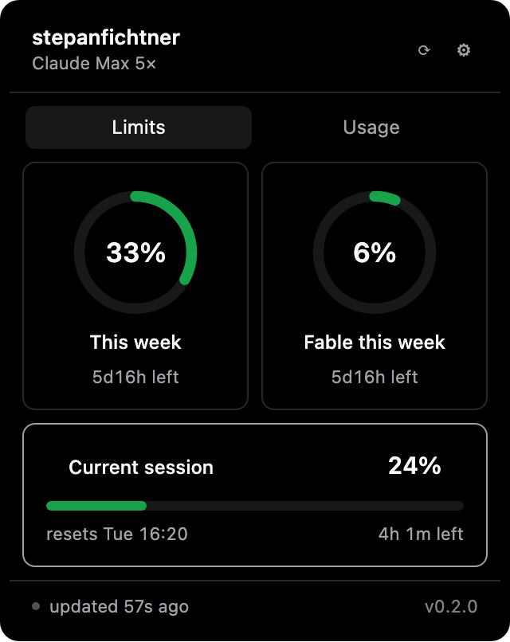
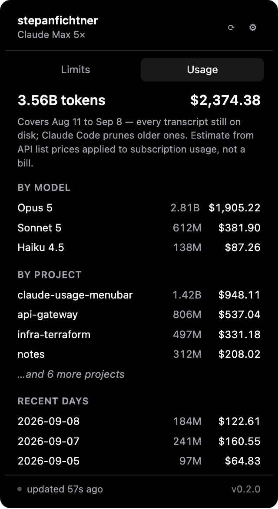

# Claude Usage

A menu bar / tray monitor for Claude subscription limits. Shows your 5-hour
session window, your weekly all-models window, and any per-model weekly windows,
with reset countdowns and threshold notifications.

The limits are account-wide, so one glance covers every Claude Code project and
the Claude desktop app at once. That is the whole reason it exists: running several
projects plus the desktop app, there is otherwise nowhere to see the total.

macOS is the platform this has actually been run on. Releases now also carry an
Ubuntu AppImage and a `.deb`, but nobody has launched either on real Linux
hardware — they exist so that a first Linux user can, and can say what happened.
Read the Ubuntu section below before you install one.

<p align="center">
  
</p>

<p align="center">
  
  
</p>

<p align="center"><sub>Example data. Top: the crab at each severity, and the four separator
choices. Bottom: the panel's two tabs — the Usage tab is optional and off by default.</sub></p>

## What it shows

In the menu bar: a crab, coloured by how much of your worst quota is gone, and
whichever figures you choose — percentage, countdown, or both, per quota. With
more than one limit up there, Settings can put a mark between them — a pipe, a
dash or a slash — so the gap between two limits doesn't read like the gap
inside one. Two spaces, as before, is the default.

| colour | |
|---|---|
| green | under 50% |
| yellow | 50-79% |
| orange | 80-89% |
| red | 90% and above |

In the panel: your account name and plan, each weekly quota as a ring, and the
current 5-hour session as a full-width meter, each with its reset time and a
countdown that ticks locally.

Notifications at 50, 80 and 90% of any quota — once per threshold per window, so
sitting above one does not produce a stream of them. The first sighting of a quota
after launch primes silently rather than firing, so a fresh install does not
announce thresholds you had already crossed before it existed.

Quotas come from the server's own list rather than a hard-coded set, so a new
model's weekly window appears without an update.

## Unofficial

This is not an Anthropic product and is not affiliated with Anthropic. It reads
an **undocumented** endpoint — the same one Claude Code's own `/usage` command
uses — which may change or disappear without notice. If that happens, the app
shows the last known figures and a message rather than crashing.

## What leaves your machine

Three kinds of outbound request, and nothing else:

- `GET /api/oauth/usage` — to `api.anthropic.com`, authenticated with the OAuth
  token Claude Code already stored when you signed in. Your limit percentages
  and reset times.
- `GET /api/oauth/profile` — to `api.anthropic.com`, the same token. Your
  account display name and subscription tier.
- The update check — to GitHub's release assets, unauthenticated. Only when
  you choose **Check for Updates…** from the tray menu; never automatically,
  and never on launch.

No telemetry, no crash reporting, no other third-party service. The app never
writes to `~/.claude/` and never modifies your Keychain.

From the profile response only the display name and the rate-limit tier are read;
the full name, email address and account identifiers in that response are never
deserialized, cached, or displayed.

## Install

### macOS

Download the `.dmg` from [Releases](../../releases) and drag the app to
Applications.

The build is **not code-signed or notarized**, so the first launch is blocked by
Gatekeeper. Right-click the app and choose *Open* — that is the same outcome as
stripping the quarantine flag, but it keeps you inside the OS flow rather than
teaching a habit of blanket-stripping downloads:

```bash
# only if right-click → Open is unavailable to you
xattr -dr com.apple.quarantine "/Applications/Claude Usage.app"
```

**What that costs you, stated plainly.** Getting past Gatekeeper this way means
macOS never assesses the app and never runs its first-launch malware scan, and
because there is no code signature there is no integrity baseline either — any
process running as you could modify the installed app afterwards and nothing
would notice. The updater checks a signature on what it *downloads*; it cannot
check the copy already on your disk. So installing this is a decision to trust
this repository's release pipeline. That pipeline pins every CI action to a
commit hash and signs every update with a key held only in GitHub secrets, which
is the most that can be offered without an Apple Developer ID.

Verify the download if you like. Once both build legs have uploaded, the release
workflow downloads every artifact back off the release, hashes it, and appends a
**SHA-256** block to that release's notes — so the list describes the exact bytes
you just fetched, not something built alongside them. Compare yours against it:

```bash
shasum -a 256 ~/Downloads/Claude.Usage_*_universal.dmg   # macOS
sha256sum ~/Downloads/Claude.Usage_*.AppImage            # Linux
```

On first run macOS may ask for permission to read the `Claude Code-credentials`
Keychain item. Choose **Always Allow** — that item is the OAuth token, and
reading it is the whole point of the app.

Worth knowing what that button does: because this app is unsigned it has no
stable code identity, so it reads the item by running Apple's own
`/usr/bin/security` tool. **Always Allow** therefore adds that general-purpose
tool to the item's access list, after which any process running as you can read
the token the same way. Claude Code most likely granted this already when it
created the item, so this is probably not widening anything — but you should know
it rather than find out.

### Ubuntu

Releases include an AppImage and a `.deb`. **Nobody has run either of them on
real Linux hardware.** The code compiles and its full test suite passes on
Ubuntu in CI on every push (see `ci.yml`), and the release workflow now builds
the two bundles from it — that is the whole of the evidence. Compiling is not
running. If you install one of these, you are the person finding out whether
this app works on Linux, and the rest of this section is written on that
assumption.

**Take the AppImage.** Download it from [Releases](../../releases), make it
executable, run it. Nothing to install and nothing to uninstall — the only trace
it leaves is its settings file under
`~/.local/share/com.stepanfichtner.claude-usage-menubar/`.

```bash
chmod +x Claude.Usage_*.AppImage
./Claude.Usage_*.AppImage
```

The AppImage is also the build the in-app updater treats most simply: **Check
for Updates…** downloads the new one and rewrites the file you ran, in place,
with no privileges involved. The `.deb` is there for anyone who would rather
have a real package, but its updates cost more — Tauri's updater installs a
`.deb` by running `dpkg -i` under `pkexec`, so **every update raises a system
password prompt**. That is the updater's design, not something this app can
switch off, and it is better read here than met later. Neither Linux update path
has been exercised any more than the rest of this, and the `.deb`'s is the one
with more moving parts, which is the second reason to take the AppImage.

**The thing most likely to be wrong.** On macOS this app reads the OAuth token
from the Keychain, via `/usr/bin/security`. There is no Keychain in the Linux
path, so it instead reads `~/.claude/.credentials.json` directly and takes
`claudeAiOauth.accessToken` out of it. That filename, that location and that
shape were never confirmed against a real Claude Code install on Linux — they
are an assumption carried across from macOS. If any part of it is wrong, the app
cannot sign in at all and every figure stays empty. This is the specific failure
this section exists to warn you about, and the first thing to check if nothing
appears.

**First run, in this order:**

1. `cat ~/.claude/.credentials.json` — does the file exist, and does it hold a
   `claudeAiOauth` object with an `accessToken` inside? If it does not, stop and
   report what you found instead. That answer is worth more than everything
   below it.
2. Launch it. Does a tray icon appear? On stock GNOME the tray needs the
   AppIndicator extension — `sudo apt install gnome-shell-extension-appindicator`,
   then log out and back in.
3. Do the figures agree with Claude Code's own `/usage`? Both read the same
   endpoint, so they should match.
4. Click the tray icon. Does the panel open, and does it show your account name
   and plan?

**Three things that are different on Linux by design.** They are not bugs, so
please do not file them as bugs — but do say if you hit something that is not on
this list:

- **The tray icon has no tooltip.** Setting one is a no-op in the AppIndicator
  backend this app uses: `tray-icon`'s `set_tooltip` is documented "Linux:
  Unsupported" and its GTK implementation returns success without doing
  anything. The tray menu label carries the same text and is reliable.
- **Notifications need a notification daemon** on your D-Bus session. A full
  GNOME or KDE desktop runs one; a minimal window manager may not, and the app
  cannot tell the difference — the call reports success either way.
- **The panel opens in the centre of the screen**, not under the tray icon. On
  macOS it is positioned against the menu bar item; there is no equivalent
  anchor on Linux, so it is centred deliberately.

**Report back in [Issues](../../issues)** — your distro and desktop, which
artifact you used, and how far down that checklist you got before something
broke, or that nothing did. That report is the only thing that moves Linux from
"we built it" to "it works". Every hedge above is there because no one has sent
one yet; the first one that arrives is what lets the hedging come out.

## Updating

If you installed a release build, choose **Check for Updates…** from the tray
menu. Whatever the check finds, it tells you in a dialog:

- **A newer version is available.** "Update available", naming both the version
  you are running and the one on offer, and saying the app will restart to
  finish installing. **Update** proceeds; **Cancel** — or Escape, or dismissing
  the alert — declines. Nothing is downloaded until you press Update: finding an
  update and fetching it are two separate steps, and your answer is what
  separates them.
- **You are already current.** "You're up to date", naming the version you are
  running.
- **Something went wrong.** "Update failed", carrying the reason in full.

Press Update and the app downloads the new bundle, installs it, and restarts
itself. The restart is the part you cannot take back, which is why the dialog
says so before you agree rather than after. Cancel costs nothing and leaves the
menu item ready for the next click.

**The menu label is the fallback channel**, behind the dialog rather than in
front of it. The moment you click, that same item reads **Checking for
updates…**, and afterwards **Up to date (vX.Y.Z)**, **Update available —
installing…**, or **Check failed —** and a shortened reason, for about 30
seconds before returning to normal. It is worth having because it is the one
channel this app fully controls — it needs no permission, no daemon and no
window — so it still tells the truth if a dialog was dismissed unread. (Cancel
skips all of that and returns the label straight to idle.)

Exactly one system notification survives, and it is the install: "Installing
version X — restarting…". The other two outcomes now raise a dialog while you
are sitting in front of the app, so a banner repeating them a second later
would be noise. The install keeps its banner because that outcome can land
minutes after your click, with you gone — but do not build on it. It is raced
against the very restart it announces, it is silenced if you have turned
notifications off in Settings, and the notification plugin cannot report whether
anything was ever actually displayed (a revoked permission, or a minimal Linux
desktop with no notification daemon, both still return success). The tray
tooltip echoes every outcome as well, and on Ubuntu that echo is a documented
no-op — see the Ubuntu section above. Treat both as a bonus.

If you're running from a source checkout instead:

```bash
git pull && pnpm run reinstall
```

Builds, stops any running copy, replaces the one in `/Applications`, relaunches, and
prints the version it installed.

## Build from source

Requires Rust 1.82+, Node 24+, pnpm 10+.

```bash
pnpm install
pnpm tauri dev     # run
pnpm tauri build   # produce installers
```

That last command finishes by signing the updater artifacts (see Releasing),
which needs the release signing key. Without it the `.app` and the `.dmg` are
still written, and the build then stops with `A public key has been found, but
no private key` — pass `--no-sign` to skip that step on a local build. `pnpm
run reinstall` already ignores it and installs the `.app` it finds.

Ubuntu build dependencies:

```bash
sudo apt install libwebkit2gtk-4.1-dev libayatana-appindicator3-dev librsvg2-dev \
  patchelf build-essential curl wget file libxdo-dev libssl-dev
```

On stock GNOME the tray needs the AppIndicator extension, which Ubuntu ships
and enables by default:

```bash
sudo apt install gnome-shell-extension-appindicator
```

Log out and back in if the icon does not appear.

The tray icons are generated, not hand-drawn — `python3 scripts/generate-tray-icons.py`
regenerates all five from the colour table at the top of that file. No image library
needed.

### If the DMG step fails

`pnpm tauri build` can occasionally fail partway through, after the `.app` is
built, with a Finder/AppleScript error from the vendored `create-dmg` step
(something like `Can't get disk ... (-1728)`, or the run leaves a stray
`rw.<pid>.*.dmg` mounted under `/Volumes`). This is a known race in that
script's Finder automation — it styles the mounted disk image's window with
`osascript`, and occasionally runs that before Finder has caught up with the
just-attached volume — not something introduced by this project. It reproduces
the same way on a from-scratch checkout of the very first commit in this
repo's history, before any of the app's own code existed, which rules out a
project-specific cause.

The `.app` bundle is unaffected and already usable at that point; re-running
`pnpm tauri build` typically succeeds on the next attempt. `pnpm run reinstall`
already accounts for this: it treats a non-zero exit from `tauri build` as
non-fatal and checks for the `.app` directly rather than trusting the exit
code.

### Tests

Two suites. `.github/workflows/ci.yml` runs exactly this on every push:

```bash
cd src-tauri
cargo fmt --all -- --check
cargo clippy --all-targets -- -D warnings
cargo test --all          # polling, parsing, tray text, settings, updater

cd ..
pnpm exec tsc --noEmit
pnpm check                # svelte-check
pnpm test                 # vitest, over src/lib
pnpm build
```

CI pins Rust to `dtolnay/rust-toolchain@stable`, so a clippy pass on an older
local toolchain does not predict it. If CI reports a lint you cannot
reproduce, check `rustc --version` before anything else.

## Releasing

Bump the version in `src-tauri/Cargo.toml` (the single source of truth —
`tauri.conf.json` inherits it, the popover footer and the User-Agent read
`CARGO_PKG_VERSION`, and `package.json` deliberately carries no version at
all, being private and unpublished), merge to `main`, then tag and push:

```bash
git tag v0.2.0 && git push origin v0.2.0
```

`.github/workflows/release.yml` refuses the tag unless it is on `main` and
matches `Cargo.toml`, then builds on two legs — macOS (universal `.dmg` +
`.app`) and Ubuntu (AppImage + `.deb`) — and publishes a draft GitHub release
with `latest.json` for the in-app updater attached. The two legs do not carry
equal weight: the macOS artifacts are the ones anyone has run, and the Ubuntu
ones are there to be tried for the first time. The Ubuntu section under Install
says so to whoever downloads them, and should keep saying so until a report
comes back. The draft's body repeats that warning, because plenty of people
reach a releases page without ever reading a README.

A third job, `checksums`, then runs once both legs are done: it pulls every
uploaded asset back down, hashes it, and appends a SHA-256 block to the draft's
notes. It is a separate job rather than a step in each leg because two legs
appending to one body concurrently is a lost-update race. Re-running it is safe —
it replaces its own previous block rather than stacking another.

`"createUpdaterArtifacts": true` in `src-tauri/tauri.conf.json` is what makes
that last part work: it is the switch that tells `tauri build` to emit the
`.app.tar.gz` and its `.sig` next to the `.dmg`. It defaults to `false`, and
without it the build produces nothing for `latest.json` to point at, so
**Check for Updates…** fails on every install no matter how correct the rest
of the pipeline is. It is load-bearing, not noise.

**Then publish the draft — that is the step that arms the updater.** The
endpoint the app polls is GitHub's `/releases/latest/download/latest.json`,
and `latest` excludes drafts, so until someone opens the draft release and
presses Publish, every installed copy's **Check for Updates…** gets a 404 and
reports a failure. The release is not out until the draft is published.

**If the macOS build job fails**, it is almost certainly the same `create-dmg`
race described above ("If the DMG step fails"), now hitting the build job's
first-ever real run instead of a local one. It affects only the human-facing
`.dmg` — the updater fetches the `.app.tar.gz` and its signature, never the
`.dmg` — so it can never break an update, and it is not a sign the release
itself is broken. Re-run just that job from the Actions tab; that is the fix,
not a rollback.

**If the signing key is ever lost** — the private half, in the
`TAURI_SIGNING_PRIVATE_KEY` / `TAURI_SIGNING_PRIVATE_KEY_PASSWORD` repository
secrets, or its password — no future release can be signed with the public
key already shipped in past installs. **Check for Updates…** on those installs
will keep reporting a failure (the downloaded bundle's signature will not
verify against the key they shipped with) rather than ever installing again,
and every existing user has to reinstall by hand from a fresh download. There
is no recovery short of that; treat the private key and its password with the
same care as the OAuth token this app reads.

## Troubleshooting

Run one fetch and print the result, without launching the UI:

```bash
cd src-tauri && cargo run -- --once
```

This is the first thing to try when the numbers look wrong or stop updating. It
exercises the credential read, both HTTP calls, and the response parsing.

**"It starts and immediately quits."** It did not. The app has no Dock icon and no
window of its own — look for the crab in the menu bar. If the bar is full, macOS
hides what does not fit; ⌘-drag icons to make room.

**Two crabs.** A copy left over from `pnpm tauri dev` is still running.
`pkill -f claude-usage-menubar` and start one.

**"showing cached data" that will not clear.** No fetch has succeeded since launch.
Check `cargo run -- --once`. The endpoint rate-limits in bursts — four requests in
ten seconds trips it and it clears after about two minutes.

## Licence

MIT.
